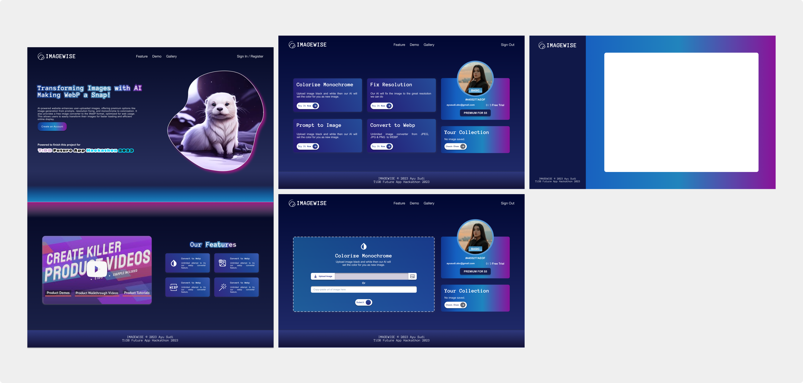
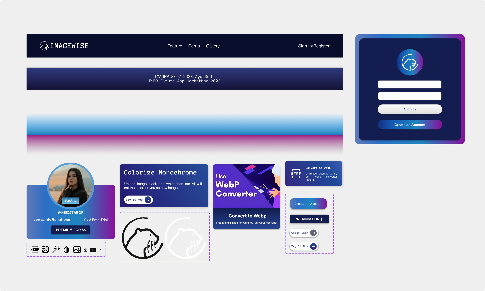

# ImageWise

[Click here to try ImageWise](https://imagewise.vercel.app/)

ImageWise is website that provide AI image feature from Third Party API.

by Ayu Sudi Dwijayanti (Solo)


## MockUp User Interface




## Implementation SSR
- TypeScript 
- Next
- NextAuth
- React
- MySQL
- Tailwind CSS

## DB Setup in Chat2Query TiDB 
```sql 
CREATE TABLE imagewise.users (
  email VARCHAR(100) NOT NULL UNIQUE,
  name VARCHAR(256) NOT NULL,
  profile_img VARCHAR(512) NOT NULL,
  hint INT DEFAULT 0,
  credit INT DEFAULT 0
);

CREATE TABLE imagewise.images (
  id  VARCHAR(100) UNIQUE,
  image VARCHAR(526) NOT NULL,
  email VARCHAR(100) NOT NULL,
  title VARCHAR(100) NOT NULL,
  feature VARCHAR(50) NOT NULL,
  created DATE
);

-- Try login gmail than after get 0 credits run UPDATE Query 

UPDATE imagewise.users 
  SET credit = 3
  WHERE email = "<EMAIL GMAIL>";


--- To read data 
SELECT * FROM imagewise.users;

-- To reset database 
DROP TABLE imagewise.images;
DROP TABLE imagewise.users;
```


## Getting Started
**Zero Step** to remove the red code due to no node_modules. 
- Open terminal 
- run `npm install`
- folder `node_modules` must be created.

**First Step**, make sure you had account at :
- TiDB 
- Google Cloud Platform 
- DeepAI
- Cloudinary

In TiDB please create a Cluster and database and try to run the setup query.

**Second Step**, create setup .env with create with this template :

```env
GOOGLE_SECRET=
GOOGLE_ID=
DB_HOST=
DB_USER=
DB_PORT=
DB_PASSWORD=
DB_NAME=
DB_SSLVERSION=
DEEPAI_KEY=
CLOUDINARY_URL=
CLOUDINARY_CLOUDNAME=
CLOUDINARY_APIKEY=
CLOUDINARY_APISECRET=
```
Note create `.env` file in same level of file `README.md`


**Third or The Last Step**, Open terminal and run this command line

```bash
npm run dev
```

Then open localhost:3000 or other port that shown in terminal. 


#### README FROM VERCEL

This is a [Next.js](https://nextjs.org/) project bootstrapped with [`create-next-app`](https://github.com/vercel/next.js/tree/canary/packages/create-next-app).

## Getting Started

First, run the development server:

```bash
npm run dev
# or
yarn dev
# or
pnpm dev
```

Open [http://localhost:3000](http://localhost:3000) with your browser to see the result.

You can start editing the page by modifying `app/page.js`. The page auto-updates as you edit the file.

This project uses [`next/font`](https://nextjs.org/docs/basic-features/font-optimization) to automatically optimize and load Inter, a custom Google Font.

## Learn More

To learn more about Next.js, take a look at the following resources:

- [Next.js Documentation](https://nextjs.org/docs) - learn about Next.js features and API.
- [Learn Next.js](https://nextjs.org/learn) - an interactive Next.js tutorial.

You can check out [the Next.js GitHub repository](https://github.com/vercel/next.js/) - your feedback and contributions are welcome!

## Deploy on Vercel

The easiest way to deploy your Next.js app is to use the [Vercel Platform](https://vercel.com/new?utm_medium=default-template&filter=next.js&utm_source=create-next-app&utm_campaign=create-next-app-readme) from the creators of Next.js.

Check out our [Next.js deployment documentation](https://nextjs.org/docs/deployment) for more details.
